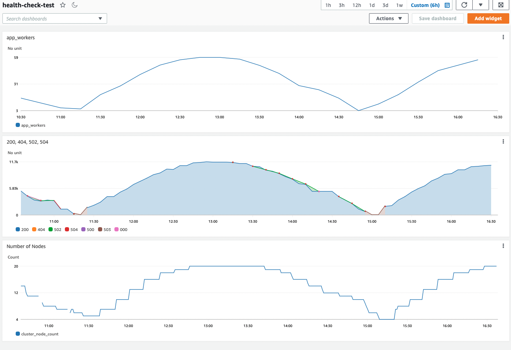

# musical-bassoon
application-health-sample-for-aws-load-balancer-controller

This sample deploys a web application behind ALB and demonstrates seamless failover between pods during scale down event triggered by cluster autoscaler or karpenter. We first deploy EKS cluser, enable Amazon CNI to enable IP-based ALB target, deploy aws-loadbalancer controller add-on, then we deploy a smaple django app that get simulated requests from a load simulator that chages the application replica-set size. We also deploy cluster autoscaler that changes the autoscale-group size to fulfill the django app pods needs. 
We observe the application health during scale-down events during the load end. We emphesize the need for accurate health check to achieve the smooth failover. 

* deploy EKS cluster 

```bash
eksctl create cluster -f eks-arm64-cluster-spec.yaml
```
* deploy [cluster autoscaler](./cluster-autoscaler-autodiscover.yaml). Update the cluster name under `node-group-auto-discovery`

* deploy [aws-loadbalancer-controllers](https://docs.aws.amazon.com/eks/latest/userguide/aws-load-balancer-controller.html)

* deploy container insights

```bash
ClusterName=lb-health-arm
RegionName=us-west-2
FluentBitHttpPort='2020'
FluentBitReadFromHead='Off'
[[ ${FluentBitReadFromHead} = 'On' ]] && FluentBitReadFromTail='Off'|| FluentBitReadFromTail='On'
[[ -z ${FluentBitHttpPort} ]] && FluentBitHttpServer='Off' || FluentBitHttpServer='On'
curl https://raw.githubusercontent.com/aws-samples/amazon-cloudwatch-container-insights/latest/k8s-deployment-manifest-templates/deployment-mode/daemonset/container-insights-monitoring/quickstart/cwagent-fluent-bit-quickstart.yaml | sed 's/{{cluster_name}}/'${ClusterName}'/;s/{{region_name}}/'${RegionName}'/;s/{{http_server_toggle}}/"'${FluentBitHttpServer}'"/;s/{{http_server_port}}/"'${FluentBitHttpPort}'"/;s/{{read_from_head}}/"'${FluentBitReadFromHead}'"/;s/{{read_from_tail}}/"'${FluentBitReadFromTail}'"/' | kubectl apply -f - 
```

* deploy [database](https://github.com/aws-samples/amazon-aurora-call-to-amazon-sagemaker-sample/tree/master/multiplayer-matchmaker/aurora-pg-cdk)

* deploy ECR repo for the django and the load simulator

```bash
./create-ecr-repos.sh
```

* build the web app docker image

```bash
cd logistics_app
./build.sh
```

* build the load simulator image

```bash
cd load_simu_app
./build.sh
```

* deploy app and load simulator

```bash
kubectl apply -f django-deploy.yaml
kubectl apply -f django-svc.yaml
kubectl apply -f django-ingres.yaml
kubectl apply -f appsimulator.yaml
```

After running the load for few load cycles, create a cloud watch dashboard of the metrics publiched by the simulator under the appsimulator namespace and the `number_node_count` in Container Insights.




In both cases, we noticed growing error rate during node scale down.
